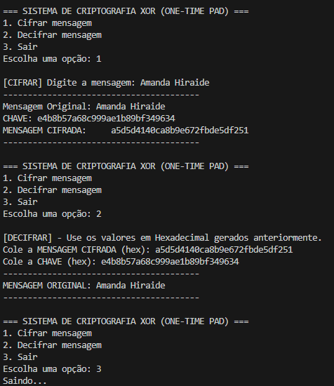

# 🔒 XOR Cipher Tool (One-Time Pad)

> Uma implementação prática de criptografia baseada em operações lógicas XOR e no conceito de One-Time Pad (OTP).



## 📌 Sobre o Projeto

Este projeto consiste em uma ferramenta de linha de comando (CLI) desenvolvida em **Python** para cifrar e decifrar mensagens seguras. 

O objetivo principal foi aplicar na prática conceitos fundamentais da Cibersegurança, demonstrando como a **Confidencialidade** pode ser atingida através de operações bit-a-bit. Diferente de cifras simples, este algoritmo implementa o conceito de **One-Time Pad**, onde a chave gerada possui o mesmo tamanho da mensagem e é utilizada apenas uma vez, garantindo segurança perfeita se a chave for verdadeiramente aleatória.

## 🚀 Funcionalidades

* **Geração de Chaves Fortes:** Utiliza a biblioteca nativa `os.urandom` para gerar entropia baseada no sistema operacional, garantindo chaves criptograficamente mais seguras que o `random` padrão.
* **Operação XOR (Exclusive OR):** Implementação manual da lógica booleana para manipulação direta de bytes.
* **Conversão Hexadecimal:** Tratamento de dados binários convertidos para hexadecimal para facilitar o transporte e a leitura da mensagem cifrada.
* **Interface CLI:** Menu interativo rodando diretamente no terminal.

## 🛠️ Tecnologias Utilizadas

* Python 3.x
* Bibliotecas: `os` (Interação com S.O.)

## 💻 Como Executar

1. Certifique-se de ter o Python 3 instalado.
2. Clone este repositório:
   ```bash
   git clone [https://github.com/Amandaaiko03/nome-do-seu-repo.git](https://github.com/Amandaaiko03/xor-otp-cipher.git)
